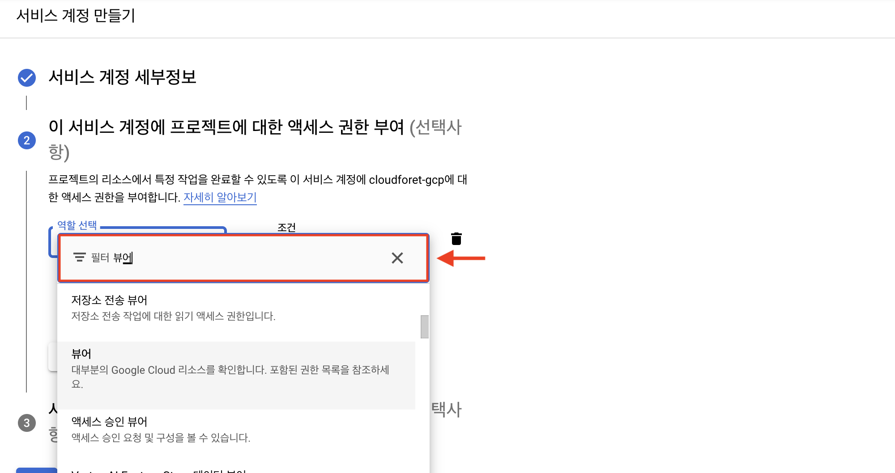
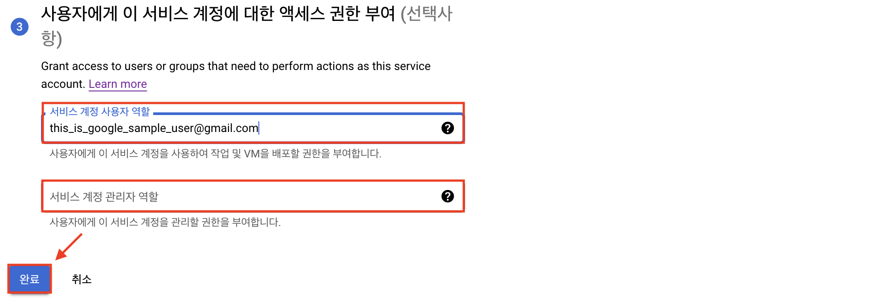
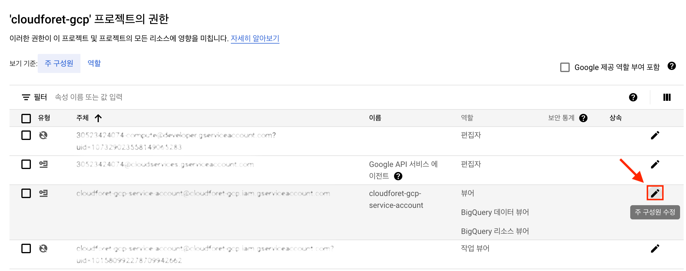
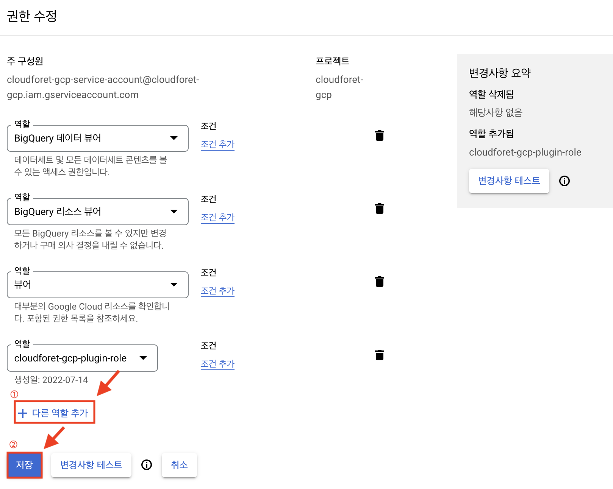

## 개요

클라우드포레서 Google Cloud 서비스 계정을 등록하기 위해서 **[Project ID]** 와 **[google_oauth2_credentials]** 에 대한 설정 정보가 필요 합니다.

> 💡 본 설정 가이드를 시작하기 앞서 **최소 하나의 프로젝트**를 생성해 주십시오.  
프로젝트 생성 가이드는 [Google Cloud Documentaion](https://cloud.google.com/resource-manager/docs/creating-managing-projects?hl=ko#creating_a_project)을 참고하십시오.

본 설정 가이드는 위에서 언급한 2가지 설정 정보들이 무엇을 의미하고, 어디서 획득하는지 자세히 알아보도록 하겠습니다.

 

### Project ID

Google Cloud에서 다른 프로젝트와 구분하기 위해 사용되는 고유한 문자열입니다.  
**Project ID** 에 대한 상세한 설명은 [Google Cloud Documentation](https://cloud.google.com/resource-manager/docs/creating-managing-projects#before_you_begin)을 참고하십시오.

### **google_oauth2_credentials**

**[google_oauth2_credentials]** 방식은 OAuth2.0 기반의 **자격증명**을 제공합니다. 
이를 통해 사용자(리소스 소유자)를 대신하여 리소스에 접근할 수 있습니다. 
Google API의 인증 방식의 상세한 설명은 [Google Cloud Documentation](https://developers.google.com/identity/protocols/oauth2?hl=en)을 참고하십시오.

2가지 개념에 대해 간략히 알아 보았습니다.

이제, 실제로 **설정 정보를 획득하는 방법**에 대해 아래 과정에서 자세히 알아보도록 하겠습니다. 

 

## 전체 Flow

클라우드포레에서는 Google Cloud 연동에 대해 OAuth2.0에 기반한 **[google_oauth2_credentials]** 방식을 지원합니다.

**[google_oauth2_credentials]** 을 이용한 방식은 아래와 같은 설정 정보가 필요합니다. 

- **[Client Email]**
- **[Client ID]**
- **[Privte Key]**
- **[Private Key ID]**
- **[Project ID]**
- **[client_x509_cert_url]**

위 정보를 획득하기 위해 아래와 같은 순서로 설정을 진행해야 합니다.

1. 서비스 계정 생성
2. 역할(Role) 생성
3. 접근 가능한 사용자 지정(선택)
4. 추가 역할(Role) 생성
5. 인증 키 생성
6. 서비스 계정 등록

 
 

## 1. 서비스 계정 생성

[서비스 계정](https://cloud.google.com/iam/docs/service-accounts)은 애플리케이션의 ID로 사용되며 서비스 계정의 역할은 애플리케이션에서 액세스 할 수 있는 리소스를 제어합니다.

**클라우드포레의 서비스계정** 과 **Google Cloud의 서비스 계정** 은 다른 개념입니다.

또한 Google Cloud는 서비스계정과 사용자 계정은 차이가 존재합니다. 

자세한 설명은 [Google Cloud Documentation](https://cloud.google.com/iam/docs/service-accounts?hl=ko#differences_between_a_service_account_and_a_user_account)을 참고 하십시오.

(1) [Google Cloud 로그인](https://accounts.google.com/ServiceLogin/signinchooser?continue=https%3A%2F%2Fcloud.google.com%2F_d%2Freturn%3Fcontinue%3Dhttps%253A%252F%252Fcloud.google.com%252Fgcp%252F&flowName=GlifWebSignIn&flowEntry=ServiceLogin) > [IAM 콘솔](https://console.cloud.google.com/projectselector2/iam-admin/iam?supportedpurview=organizationId,folder,project&orgonly=true) 이동

(1-1)[IAM 및 관리자 > 서비스 계정] 메뉴에서 [서비스 계정 만들기]를 클릭합니다.

(2)서비스 계정 세부 정보를 입력합니다

(2-1) [만들고 계속하기] 버튼을 클릭합니다.

 
 

## 2. 역할(Role) 생성

[역할](https://cloud.google.com/iam/docs/understanding-roles?hl=ko)은 권한의 모음 입니다. 

역할은 Google Cloud 리소스에서 특정 작업을 수행할 수 있는 권한을 포함하고 있습니다.

서비스 계정에 역할을 부여하게 되면 역할에 포함된 모든 권한을 부여받게 됩니다.

Google Cloud 리소스를 수집하기 위해 필요한 권한목록은 아래와 같습니다.

 

| Service | URL |
| --- | --- |
| Compute Engine | https://github.com/spaceone-dev/plugin-google-cloud-inven-collector/#compute-engine |
| Networking | https://github.com/spaceone-dev/plugin-google-cloud-inven-collector/#networking |
| Cloud SQL | https://github.com/spaceone-dev/plugin-google-cloud-inven-collector/#cloud-sql |
| Storage | https://github.com/spaceone-dev/plugin-google-cloud-inven-collector/#storage |
| Bing Query | https://github.com/spaceone-dev/plugin-google-cloud-inven-collector/#bigquery |

 

(1) 서비스 계정에 부여할 권한을 선택합니다.

(1-1) [역할 선택]을 클릭하여 검색창에  `뷰어` 를 입력하여 조건에 부합하는 권한 목록을 확인합니다.

(1-2) 권한 목록 중 [뷰어]를 선택합니다.

(1-3) [다른 역할 추가] 버튼을 클릭하여 검색창에 `BigQuery 리소스 뷰어` 와 `BigQuery 데이터 뷰어` 를 입력 후 역할을 추가합니다.

(1-4) [계속] 버튼을 클릭합니다.

> 💡 위 과정은 플러그인 실행에 필요한 일부 권한만 가지고 있습니다.  
추가적으로 [[4. 추가 역할(Role) 생성](#4-추가-역할Role-생성)] 과정을 진행하여 권한을 부여해야 합니다.

## 3. 접근 가능한 사용자 지정(선택)

Google Cloud에서 서비스 계정에 접근할 수 있는 계정을 추가 할 수 있습니다.

이 과정은 생략할 수 있습니다. 자세한 설명은 [Google Cloud Documentation](https://cloud.google.com/iam/docs/impersonating-service-accounts?_ga=2.105995587.-1313572510.1657024428&_gac=1.250300276.1657701814.CjwKCAjw2rmWBhB4EiwAiJ0mtYsa93F_vckP4cRoTJMHvwj00MwAj6_vLe5zPC-rnTr5BHU_1YebSRoCY6MQAvD_BwE)을 참고 하십시오.  

[서비스 계정 사용자 역할]은 입력한 계정에게 서비스 계정에 대한 작업 및 VM을 배포할 권한을 부여합니다.  
[서비스 계정 관리자 역할]은 입력한 계정에게 서비스 계정을 관리할 권한을 부여합니다.
 

(1) [서비스 계정 사용자 역할] 또는 [서비스 계정 관리자 역할] 필드에 권한을 부여할 계정을 입력해 주세요.

(1-1) 설정값을 입력  후 [완료] 버튼을 클릭합니다.

 
 

## 4. 추가 역할(Role) 생성

앞서 생성한 역할은 플러그인이 필요로하는 권한이 일부 빠져 있습니다. 
추가 역할 생성을 통해 필요한 권한을 부여합니다.

 

| Service | Name |
| --- | --- |
| Cloud Storage | storage.buckets.get |
| Cloud Storage | storage.buckets.getIamPolicy |
| Cloud Storage | storage.buckets.list |
| Cloud Storage | storage.objects.get |
| Cloud Storage | storage.objects.getIamPolicy |
| Cloud Storage | storage.objects.list |

 

(1) [IAM > 역할] 메뉴로 이동 후 [역할 만들기] 버튼을 클릭합니다.

(2) 권한을 검색하여 역할을 생성하는 과정입니다.

(2-1) [제목]에 값을 입력 후 [권한 추가] 버튼을 클릭합니다.

(2-2) 위의 테이블에 있는 [Name]에 해당하는 값을 [필터] 검색창에 검색하여 권한을 추가 합니다.

(3) 추가된 권한을 확인 후 [만들기] 버튼을 클릭하여 역할 생성을 완료합니다.

(4) [IAM 및 관리자 > IAM] 메뉴로 이동합니다.

(4-1) 역할을 부여할 서비스 계정의 [연필 아이콘] 을 클릭합니다.

(5) [다른 역할 추가] 버튼을 클릭하여 추가로 생성한 역할을 서비스 계정에 추가합니다.

(5-1) 추가가 완료되었으면 [저장] 버튼을 클릭합니다.

## 5. 인증 키 생성

인증키는 Google Cloud 리소스를 접근하기 위한 **자격 증명** 정보를 가지고 있습니다.

(1) [IAM 및 관리자 > 서비스 계정] 메뉴에서 서비스 계정 이메일을 클릭합니다.

(2) [키] 탭 메뉴를 클릭합니다.

(2-1) [키 추가 > 새 키 만들기] 버튼을 클릭합니다.

(3) 키 유형 중 JSON 방식을 클릭한 후 [만들기] 버튼을 클릭합니다.

(3-1) 로컬 컴퓨터에 비공개 키가 JSON 파일로 저장됩니다.

해당 JSON파일에 클라우드포레에서 Google Cloud 서비스계정 등록 시 필요한 설정 정보가 존재합니다.

## 6. 서비스 계정 등록

이제 서비스 계정 추가를 위한 준비가 끝났습니다.

지금까지 설정 가이드를 진행하면서 얻은 설정 정보를 활용해 서비스 계정을 등록 할 수 있습니다.

서비스 계정 등록의 자세한 방법은 [[클라우드포레 사용자 가이드]](https://spaceone.org/ko/docs/guides/asset-inventory/service-account/#%EC%84%9C%EB%B9%84%EC%8A%A4-%EA%B3%84%EC%A0%95-%EC%B6%94%EA%B0%80%ED%95%98%EA%B8%B0)를 참고 하십시오.

(1) **[Project ID]** 설정 정보 확인

(1-1) [Google Cloud 대시보드](https://console.cloud.google.com/home?_ga=2.4664371.1206556632.1657625937-1313572510.1657024428&_gac=1.117051380.1657701814.CjwKCAjw2rmWBhB4EiwAiJ0mtYsa93F_vckP4cRoTJMHvwj00MwAj6_vLe5zPC-rnTr5BHU_1YebSRoCY6MQAvD_BwE)로 이동합니다.

(1-2) 프로젝트를 선택 후 [열기] 버튼을 클릭합니다.

(1-3) [프로젝트 번호]에서 **[Project ID]** 를 확인 할 수 있습니다.

(1-4) 클라우드포레 서비스 계정 추가 시 **Project ID** 필드에 Google Cloud의 프로젝트 번호를 입력해 주십시오.

(2) **[google_oauth2_credentials]** 방식에 필요한 설정 정보 입니다.
 [[5. 인증 키 생성](#5-인증-키-생성)] 과정에서 다운 받은 JSON 파일에 아래 설정 정보가 담겨 있습니다.

- **[Client Email]**
- **[Client ID]**
- **[Privte Key]**
- **[Private Key ID]**
- **[Project ID]**
- **[client_x509_cert_url]**

(2-1) 설정 정보를 직접 입력하는 방식입니다.

다운로드받은 JSON 파일의 내용 중 각각의 설정 정보에 해당하는 값을 복사 후 붙여넣기 합니다.

(3) JSON으로 설정 정보를 입력하는 방식입니다.

다운로드받은 JSON 파일의 내용을 복사 후 붙여넣기 합니다.

(3-1) [저장] 버튼을 클릭합니다.

(3) 이후 클라우드포레의 **컬렉터 플러그인** 생성 방법은 [[클라우드포레의 사용자 가이드]](https://spaceone.org/ko/docs/guides/asset-inventory/collector/)를 참고하십시오.