## 개요

클라우드포레서 Google Cloud 서비스 계정을 등록하기 위해서 **[Project ID]** 와 **[google_oauth2_credentials]** 에 대한 설정 정보가 필요 합니다.

> 💡 본 설정 가이드를 시작하기 앞서 **최소 하나의 프로젝트**를 생성해 주십시오.  
프로젝트 생성 가이드는 [Google Cloud Documentation](https://cloud.google.com/resource-manager/docs/creating-managing-projects#creating_a_project)을 참고하십시오.

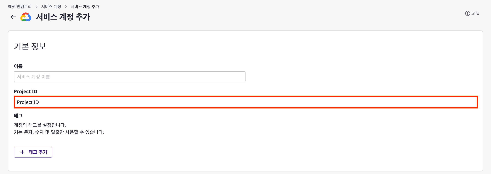
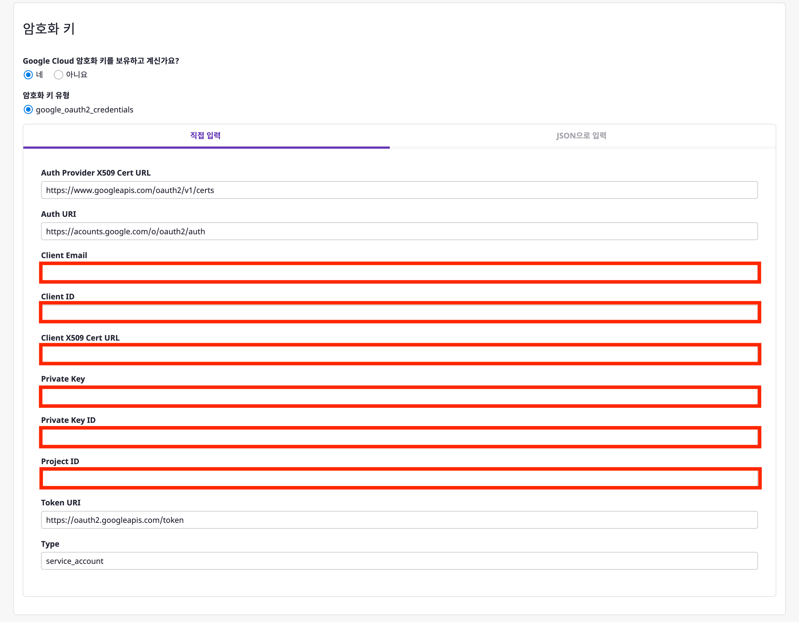

본 설정 가이드는 위에서 언급한 2가지 설정 정보들이 무엇을 의미하고, 어디서 획득하는지 자세히 알아보도록 하겠습니다.

 

### Project ID

Google Cloud에서 다른 프로젝트와 구분하기 위해 사용되는 고유한 문자열입니다.  
**Project ID** 에 대한 상세한 설명은 [Google Cloud Documentation](https://cloud.google.com/resource-manager/docs/creating-managing-projects#before_you_begin)을 참고하십시오.

 

### **google_oauth2_credentials**

**[google_oauth2_credentials]** 방식은 OAuth2.0 기반의 **자격증명**을 제공합니다.   
이를 통해 사용자(리소스 소유자)를 대신하여 리소스에 접근할 수 있습니다.   
Google API의 인증 방식의 상세한 설명은 [Google Cloud Documentation](https://developers.google.com/identity/protocols/oauth2?hl=en)을 참고하십시오.

 
2가지 개념에 대해 간략히 알아 보았습니다.  

이제, 실제로 **설정 정보를 획득하는 방법** 에 대해 아래 과정에서 자세히 알아보도록 하겠습니다.

 

## 전체 Flow

클라우드포레에서는 Google Cloud 연동에 대해 OAuth2.0에 기반한 **[google_oauth2_credentials]** 방식을 지원합니다.    
**[google_oauth2_credentials]** 을 이용한 방식은 아래와 같은 설정 정보가 필요합니다. 

- **Client Email**
- **Client ID**
- **Privte Key**
- **Private Key ID**
- **Project ID**
- **client_x509_cert_url**

위 정보를 획득하기 위해 아래와 같은 순서로 설정을 진행해야 합니다.

1. [Google Cloud 서비스 계정 생성](#1-Google-Cloud-서비스-계정-생성)  
2. [역할(Role) 생성](#2-역할(Role)-생성)  
3. [추가 역할(Role) 생성](#3-추가-역할(Role)-생성)  
4. [인증 키 생성](#4-인증-키-생성)  
5. [SpaceONE 서비스 계정 등록](#5-SpaceONE-서비스-계정-등록)  

 
 

## 1. Google Cloud 서비스 계정 생성
[서비스 계정](https://cloud.google.com/iam/docs/service-accounts)(Service Account) 은 Google Cloud 의 리소스에 접근 가능한 계정입니다.  
클라우드 포레에서는 Google Cloud 에서 제공하는 서비스 계정을 통해 리소스 정보 수집을 수행합니다.

>💡 **클라우드포레의 서비스계정** 과 **Google Cloud의 서비스 계정** 은 다른 개념입니다.  
> 또한 Google Cloud는 서비스계정과 사용자 계정은 차이가 존재합니다.   
> 자세한 설명은 [Google Cloud Documentation](https://cloud.google.com/iam/docs/service-accounts#differences_between_a_service_account_and_a_user_account)을 참고 하십시오.

 

(1-1) [Google Cloud 로그인](https://cloud.google.com/gcp/?hl=en) > [IAM 콘솔](https://console.cloud.google.com/projectselector2/iam-admin/iam?supportedpurview=organizationId,folder,project&orgonly=true) 이동 후 프로젝트를 클릭합니다.  
(1-2) [IAM 및 관리자 > 서비스 계정] 메뉴에서 [서비스 계정 만들기]를 클릭합니다.

(1-3) 서비스 계정 세부 정보를 입력합니다.  
(1-4) [만들고 계속하기] 버튼을 클릭합니다.

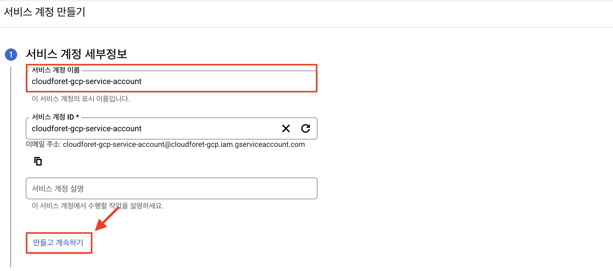

 
 

## 2. 역할(Role) 생성 및 Service account에 추가

[역할](https://cloud.google.com/iam/docs/understanding-roles#basic)은 Google Cloud 리소스에서 특정 작업을 수행할 수 있는 권한을 포함하고 있습니다.  
서비스 계정에 역할을 부여하게 되면 역할에 포함된 권한을 부여받게 됩니다.

Google Cloud 플러그인이 리소스 정보를 수집하기 위해 서비스 계정에 적절한 권한을 설정해야 합니다.  
해당 컬렉터 플러그인은 읽기 권한 이외의 어떠한 권한도 필요하지 않습니다.

컬렉터 플러그인이 수집할 수 있는 Google Cloud 서비스와 리소스를 수집하기 위해 필요한 권한 목록은 아래와 같습니다.   
구글 컬렉터 플러그인은 총 8개 서비스에 대해 수집하고 있으며 이에 따른 필요한 권한을 갖는 롤을 생성해야 합니다.

각 서비스 별 필요한 권한은 표의 Required Role에 해당하며 각각의 롤은 Storage 뷰어(Custom)를 제외하면  
Google에서 제공하는 Default 롤에 해당합니다. ( 한국어 기준 Role 명칭 )

 

| No | Service        | Required Role                       | URL                                                                                  |
|----|----------------|-------------------------------------|--------------------------------------------------------------------------------------|
| 1  | Compute Engine | Compute 뷰어                          | https://github.com/cloudforet-io/plugin-google-cloud-inven-collector/#compute-engine |
| 2  | Networking     | Compute 뷰어                          | https://github.com/cloudforet-io/plugin-google-cloud-inven-collector/#networking      |
| 3  | Cloud SQL      | Cloud SQL 뷰어                        | https://github.com/cloudforet-io/plugin-google-cloud-inven-collector/#cloud-sql       |
| 4  | Storage        | Storage 뷰어(Custom), 환경 및 스토리지 객체 뷰어 | https://github.com/cloudforet-io/plugin-google-cloud-inven-collector/#storage         |
| 5  | BigQuery       | BigQuery 리소스 뷰어                     | https://github.com/cloudforet-io/plugin-google-cloud-inven-collector/#bigquery        |
| 6  | Cloud Pub/Sub  | 게시/구독 뷰어                            | https://github.com/cloudforet-io/plugin-google-cloud-inven-collector/tree/master#pubsub|
| 7  | Cloud Functions     | Cloud 함수 뷰어                         |https://github.com/cloudforet-io/plugin-google-cloud-inven-collector/tree/master#Functions        |
| 8  | Recommender     | 클라우드 애셋 뷰어, 추천자 뷰어                  | https://github.com/cloudforet-io/plugin-google-cloud-inven-collector/tree/master#Recommender        |

먼저, 필요한 Custom 롤에 대해 추가하는 작업을 진행하겠습니다.  
이후, Default 롤과 함께 Service account에 롤을 추가하는 작업을 진행하겠습니다.

### Custom Role 생성

Storage 뷰어를 default 롤로 지원하지 않아 Custom 롤을 생성해야 합니다.  
아래 표는 Storage 뷰어(Custom)에 필요한 권한 목록입니다.
 

| Service | Name |
| --- | --- |
| Cloud Storage | storage.buckets.get |
| Cloud Storage | storage.buckets.getIamPolicy |
| Cloud Storage | storage.buckets.list |
| Cloud Storage | storage.objects.get |
| Cloud Storage | storage.objects.getIamPolicy |
| Cloud Storage | storage.objects.list |

 

(2-1) [IAM 및 관리자 > 역할] 메뉴로 이동 후 [역할 만들기] 버튼을 클릭합니다.

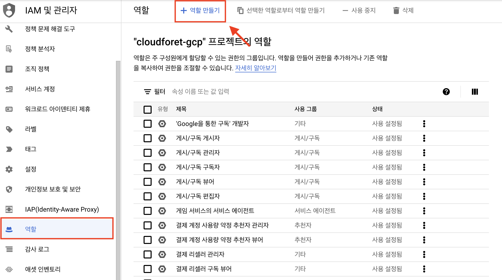

(2-2) 권한을 검색하여 역할을 생성하는 과정입니다.  
(2-3) [제목]에 값을 입력 후 [권한 추가] 버튼을 클릭합니다.

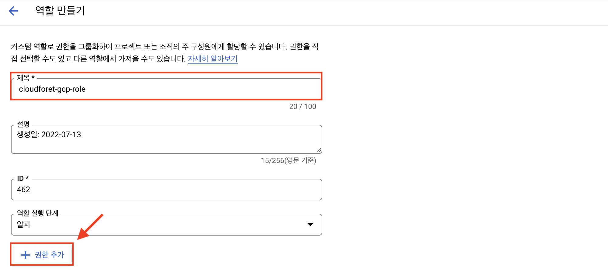

(2-4) 위의 테이블에 있는 [Name]에 해당하는 값을 [필터] 검색창에 검색하여 권한을 추가 합니다.

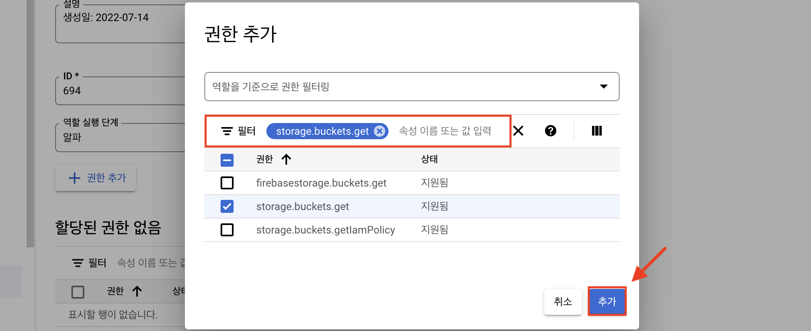

(2-5) 추가된 권한을 확인 후 [만들기] 버튼을 클릭하여 역할 생성을 완료합니다.

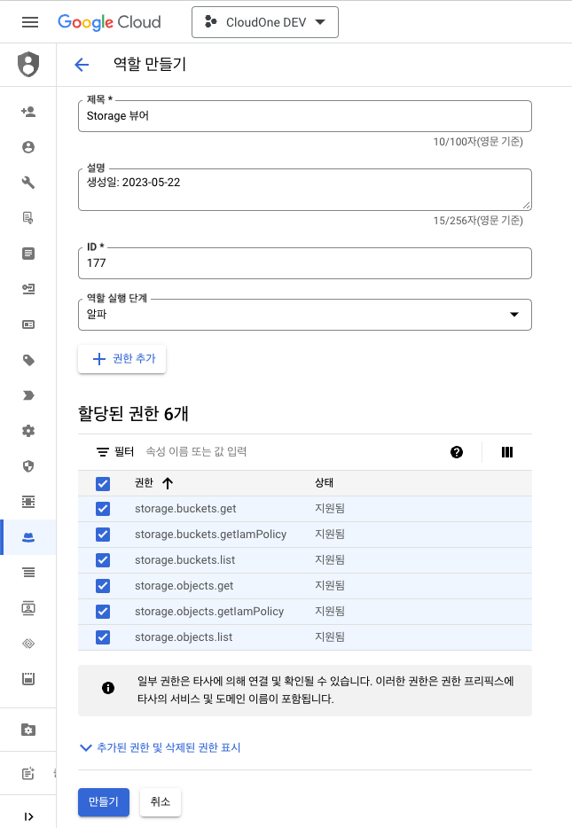

 
 

### Service Account에 롤(Role) 추가

(1-4)의 [만들고 계속하기] 버튼을 이후 작업을 진행하도록 합니다.  
**2. 역할(Role) 생성 및 Service account에 추가**의 표에서 Required Role에 해당하는 롤을 추가하고  
생성한 Custom Role을 추가하는 작업을 진행합니다.

(2-6) 서비스 계정에 부여할 권한을 선택합니다.  
(2-7) [역할 선택]을 클릭하여 커스텀을 선택해 기 생성한 롤을 추가 해줍니다.
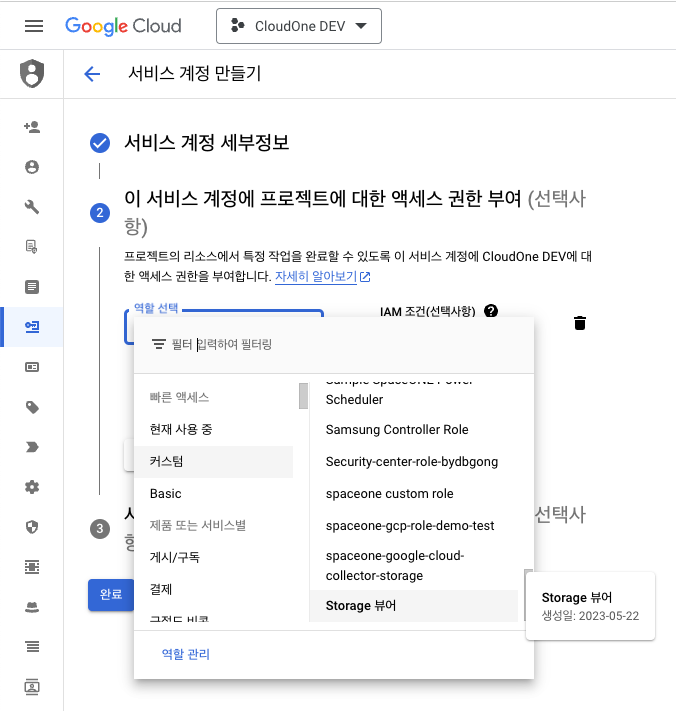

(2-8) [다른 역할 추가] 버튼을 클릭하여 검색창에 필요한 롤을 9개를 추가합니다.
* Custom Role (1개)
  * Storage 뷰어
* Default Role (8개)
  * Compute 뷰어
  * Cloud SQL 뷰어
  * BigQuery 리소스 뷰어
  * 게시/구독 뷰어
  * Cloud 함수 뷰어
  * 클라우드 애셋 뷰어
  * 추천자 뷰어
  * 환경 및 스토리지 객체 뷰어

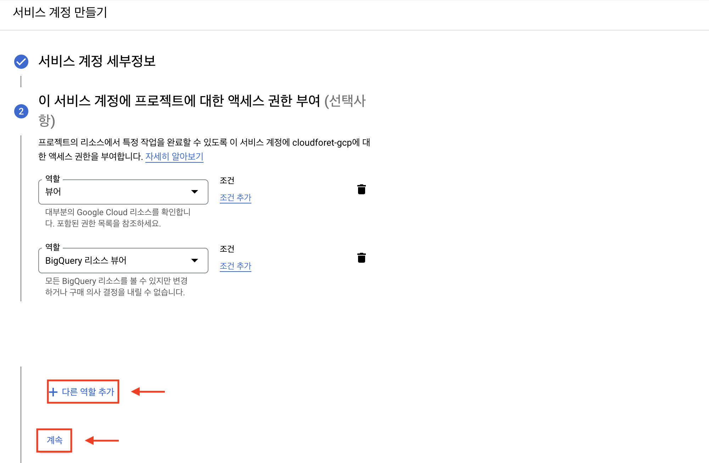

(2-9) [계속] 버튼을 클릭합니다.

(2-10) [완료] 버튼을 클릭하여 역할 생성을 마무리합니다.

> 💡 위 과정은 Custom Role 생성과 Service Account 생성 후 필요한 롤을 추가하는 과정입니다.  
> Custom Role 생성은 (2-1 ~ 2-5)를 참고하시고, 나머지는 가이드 순서에 맞게 진행하시면 되겠습니다.

 
 

## 3. 인증 키 생성

인증키는 Google Cloud 리소스를 접근하기 위한 **자격 증명** 정보를 가지고 있습니다.

(3-1) [IAM 및 관리자 > 서비스 계정] 메뉴에서 서비스 계정 이메일을 클릭합니다.

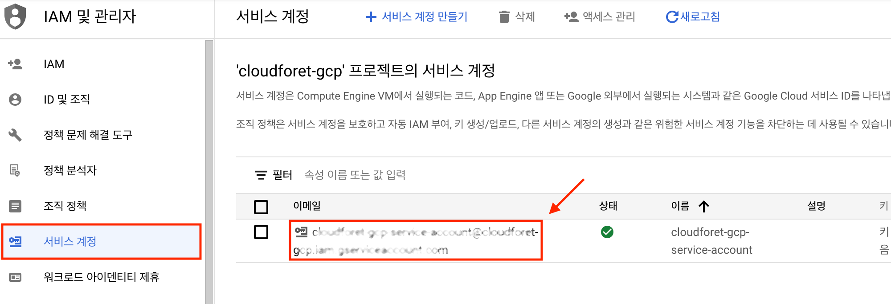

(3-2) [키] 탭 메뉴를 클릭합니다.  
(3-3) [키 추가 > 새 키 만들기] 버튼을 클릭합니다.

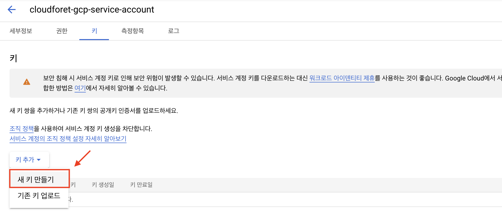

(3-4) 키 유형 중 JSON 방식을 클릭한 후 [만들기] 버튼을 클릭합니다.
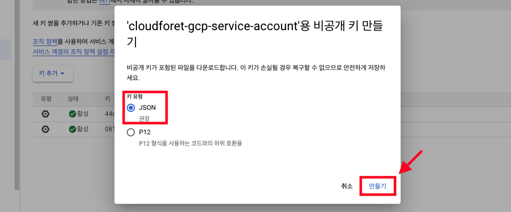

(3-5) 로컬 컴퓨터에 비공개 키가 JSON 파일로 저장됩니다.  
다운로드 받은 JSON 파일에는 클라우드포레에서 서비스 계정 등록 시 필요한 설정 정보가 존재합니다.

 
 

## 4. SpaceONE 서비스 계정 등록

이제 클라우드포레의 서비스 계정 추가를 위한 준비가 끝났습니다.  
지금까지 설정 가이드를 진행하면서 얻은 설정 정보를 활용해 서비스 계정을 등록 할 수 있습니다.  
서비스 계정 등록의 자세한 방법은 [[클라우드포레 사용자 가이드]](https://spaceone.org/ko/docs/guides/asset-inventory/service-account/#%EC%84%9C%EB%B9%84%EC%8A%A4-%EA%B3%84%EC%A0%95-%EC%B6%94%EA%B0%80%ED%95%98%EA%B8%B0)를 참고 하십시오.

 

(4-1) **[Project ID]** 설정 정보를 확인합니다.  
(4-2) [Google Cloud 대시보드](https://console.cloud.google.com/home?_ga=2.4664371.1206556632.1657625937-1313572510.1657024428&_gac=1.117051380.1657701814.CjwKCAjw2rmWBhB4EiwAiJ0mtYsa93F_vckP4cRoTJMHvwj00MwAj6_vLe5zPC-rnTr5BHU_1YebSRoCY6MQAvD_BwE)로 이동합니다.  
(4-3) 프로젝트를 선택 후 [열기] 버튼을 클릭합니다.

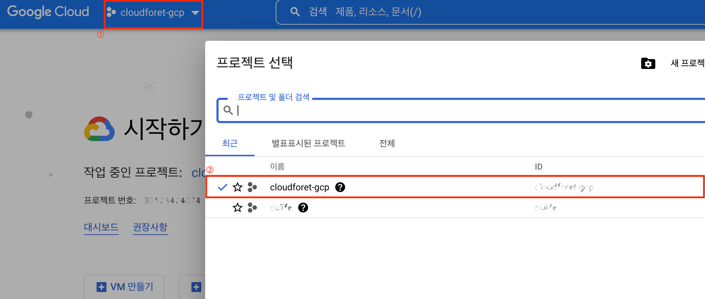

(4-4) [프로젝트 번호]에서 **[Project ID]** 를 확인 할 수 있습니다.

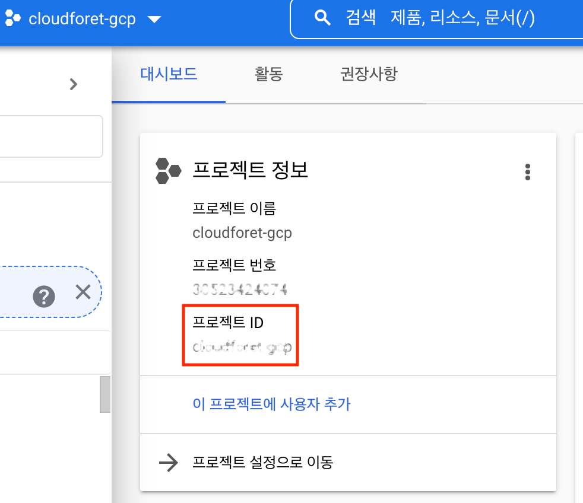

(4-5) 클라우드포레 서비스 계정 추가 시 **Project ID** 필드에 Google Cloud의 프로젝트 번호를 입력해 주십시오.

(4-6) **[google_oauth2_credentials]** 방식에 필요한 설정 정보 입니다.  
 [[4. 인증 키 생성](#4-인증-키-생성)] 과정에서 다운 받은 JSON 파일에 아래 설정 정보가 담겨 있습니다.

- **[Client Email]**
- **[Client ID]**
- **[Privte Key]**
- **[Private Key ID]**
- **[Project ID]**
- **[client_x509_cert_url]**
 

위 정보를 클라우드포레에 입력하는 방식은 크게 두가지 방법을 제공합니다.
1. 직접 입력
2. JSON으로 입력

(4-7) 설정 정보를 직접 입력하는 방식입니다.  
다운로드받은 JSON 파일의 내용 중 각각의 설정 정보에 해당하는 값을 복사 후 붙여넣기 합니다.

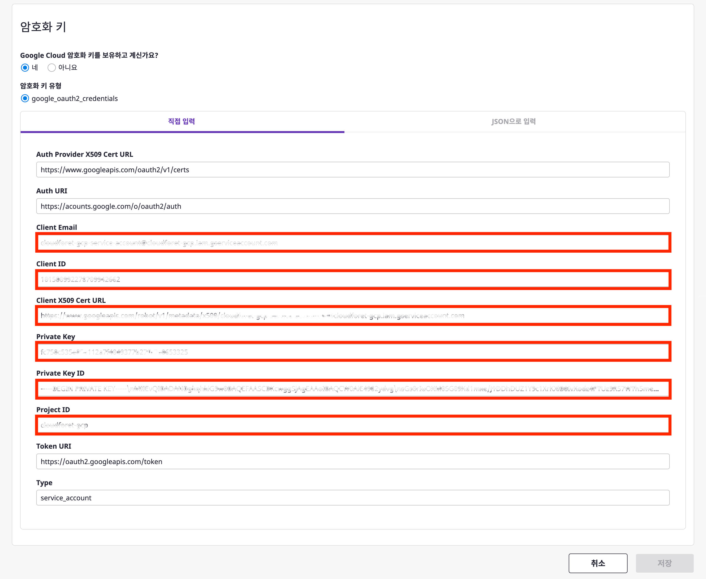

(4-8) JSON으로 설정 정보를 입력하는 방식입니다.  
다운로드받은 JSON 파일의 내용을 복사 후 붙여넣기 합니다.

(4-9) [저장] 버튼을 클릭합니다.

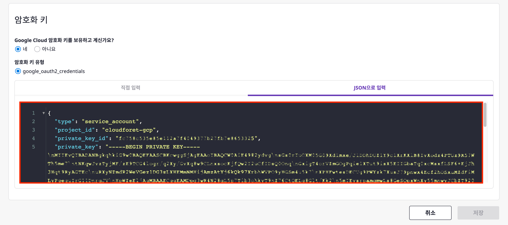

이제 클라우드포레의 서비스 계정 등록이 완료되었습니다.  
클라우드포레의 **컬렉터 플러그인** 생성 방법은 [[클라우드포레의 사용자 가이드]](https://spaceone.org/ko/docs/guides/asset-inventory/collector/)를 참고하십시오.